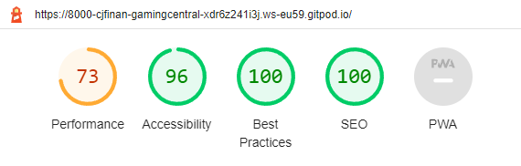

# Gamers Central

Welcome to Gamers Central! This is the place for all your gaming community needs, Find out who we are, Whats events are going on and how to get invovled. This site is targeted towards gamers looking for a inclusive gaming enviroment, a place to make lifetime friends and lifelong memories.

## Features

__Navigation Bar__

- Navigation bar for all consumers needs, fully responsive with interactive features taking you to different sections throughout the page.
If you want to find out, more about gamers central, upcoming events and how to get involved its all there with corrosponding section colours so you know youre in the right place.

__Hero Image__

- This images introduces people to the friendly and overall feel of Gamers Central
- Eye catching image draws attention

__About Section__

- This section tells you everything you need to know about Gamers Central
- Creates a idilic gaming image within the users head influencing them to sign up 

__Events Section__

- This section shows the user how active the commuinty really is and gives them a flavour of what they could be involved in
- An eye catching design, presenting clear information

__Sign Up__

- This eye catching section shows the user how easy it is for them to join the community
- Fully functional Form that is interactive and requires users to fill out all sections

__Footer__

- This footer section includes links to all relivant social medias platforms
- This encourages the user to stay connected

## Testing

__Validation Testing__

- Developer tools where used to check the sites responsiveness for a range of different potential screen sizes
- All links and forms were tested to make sure they opened in a new tab with no return

- No errors were returned when passing it through the official [W3C validator](https://validator.w3.org/#validate_by_input)
- No errors were returned when passing it through the official [W3C CSS Validation](https://jigsaw.w3.org/css-validator/)

__Lighthouse__ 

- Lighthouse was used through chrome dev tools to analyse for the following 
 - Performace
 - Acessibility
 - Best practice
 - SEO

 This was done for desktop 

 

 __Further Testing__

 Testing was carried out using Chrome, Microsoft edge and firefox

 Responsiveness was test through google chromes dev tools on a number of devices that include;
  - Iphone 12 Pro
  - Iphone SE
  - Ipad
  - Ipad Air
  - Ipad Mini
  - Pixel 5
  - Galaxy S8+
  - Surface Duo

  ## Deployment

  The site was deployed to GitHub pages. The steps to deploy are as follows:
  - In the GitHub repository, navigate to the Settings tab
  - From the source section drop-down menu, select the Master Branch
  - Once the master branch has been selected, the page will be automatically refreshed with a detailed ribbon display to indicate the successful deployment.

  You can view the live site here : 

  ## Techonologies Used

  HTML5
  CSS3
  Balsamiq

  ## Issues / Bugs

  1) Using absolute paths for images or file paths.
      - GitPod uses relative paths rather than absolute

  2) Typos
     - When prood reading through the website typos were corrected

  3) Getting the slogan to apear underneath the logo
     - I intialy struggled to get the slogan to apear undearneath the logo but got around it by wrapping the slogan in a div so it was easier to position

## Unresolved

Improvement of performance - even with compressed versions of my images they are still making the site a little slower to load. Lighthouse recomends saving image files in webP aswell as using the correct size images.

## Credits

 ### Content
  - The icons within the wbesite were taken from [Font Awesome](https://fontawesome.com/)
  - [w3schools](https://www.w3schools.com/) was used to refresh my memory on the 'display' rule

 ### Media
 - All media were taken from [Pexels](https://www.pexels.com/)